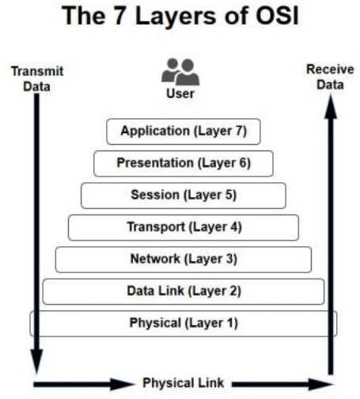
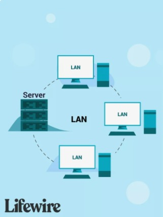
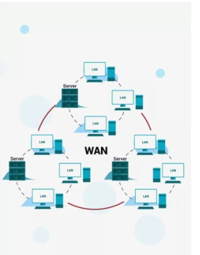
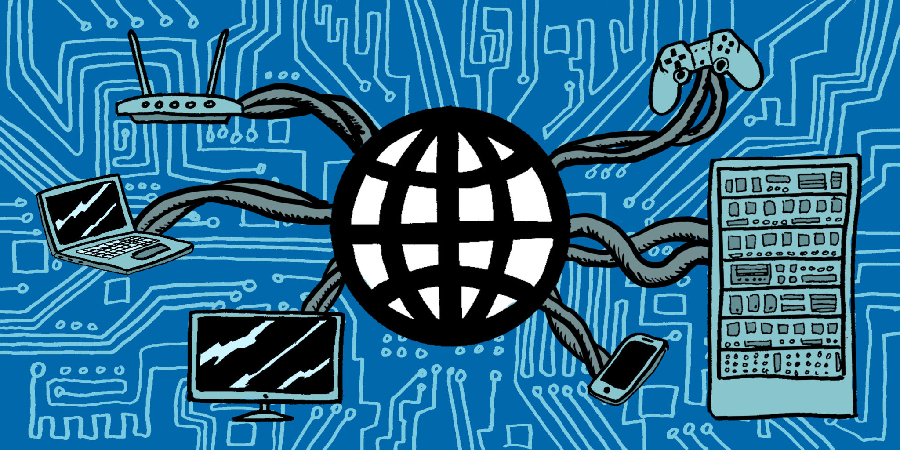

# 0x07. Networking basics #0

## Resources:books:
Read or watch:
* [OSI model](https://intranet.hbtn.io/rltoken/ERGikvYsVP3sa9ZdlAAV4w)
* [Different types of network](https://intranet.hbtn.io/rltoken/H2peG3mV1MDDEK9c9FpGjA)
* [LAN network](https://intranet.hbtn.io/rltoken/GLVy5U4Ja4c2BnKYDPwT5Q)
* [WAN network](https://intranet.hbtn.io/rltoken/IghQOBbQi3Y-H82l3s9ERg)
* [Internet](https://intranet.hbtn.io/rltoken/osfQ04v-6oWuX4LdcpMYfQ)
* [MAC address](https://intranet.hbtn.io/rltoken/DjY02-vo10kphmiYSa2Msg)
* [What is an IP address](https://intranet.hbtn.io/rltoken/_pRm6TVS3zWV_cKg51Gn4Q)
* [Private and public address](https://intranet.hbtn.io/rltoken/Tj1tSxadTHv8kS9Q7lzTpQ)
* [IPv4 and IPv6](https://intranet.hbtn.io/rltoken/t9AVXK9jpPJrL5ikz5fvKA)
* [Localhost](https://intranet.hbtn.io/rltoken/uqDHdS73W-CJQakM8vERtQ)
* [TCP and UDP](https://intranet.hbtn.io/rltoken/nOeDjXQrw-N8eFmTBiuzqw)
* [TCP/UDP ports List](https://intranet.hbtn.io/rltoken/gfKJyK0ztzhyNO0SIvVibQ)
* [What is ping /ICMP](https://intranet.hbtn.io/rltoken/OPrB4crHtTLwUynA5YjVNw)
* [Positional parameters](https://intranet.hbtn.io/rltoken/yN_ZinFzBaLXuJhOhKiMfw)

---

# Learning Objectives:bulb:

## OSI Model :information_source:

### What it is?
* The **O**pen **S**ystem **I**nterconnection (**OSI**) model defines a networking framework to implement protocols in seven layers.

### How many layers it has and  How it is organized

 

---

## What is a **LAN**
 A local area network (**LAN**) is a collection of devices connected together in one physical location, such as a building, office, or home. A LAN can be small or large, ranging from a home network with one user to an enterprise network with thousands of users and devices in an office or school.
  

  

### Typical usage
* For example, in an office with multiple departments, such as accounting, IT support, and administration, each department's computers could be logically connected to the same switch but segmented to behave as if they are separate.
### Typical geographical size
*   A network that spans a small geographic area, such as
 a single building or buildings close to each other. **(small range (< 100m))**

---

##  What is a **WAN**
 Short for wide area network, a WAN is a collection of computers and devices connected by a communications network over a wide geographic area. Wide area networks are commonly connected either through the Internet or special arrangements made with phone companies or other service providers.
  

### Typical usage
* On a smaller scale, a business may have a WAN that's comprised of cloud services, its headquarters, and branch offices. The WAN, in this case, connects those sections of the business.
### Typical geographical size
* A wide area network spans a large geographic area such as a city, state, or country

---

## What is the Internet :blue_heart:
  

### What is an IP address
* The internet is a globally connected network system facilitating worldwide communication and access to data resources through a vast collection of private, public, business, academic and government networks. It is governed by agencies like the Internet Assigned Numbers Authority (or IANA) that establish universal protocols.
The terms internet and World Wide Web are often used interchangeably, but they are not exactly the same thing; the internet refers to the global communication system, including hardware and infrastructure, while the web is one of the services communicated over the internet.
### What are the 2 types of IP address
* Public and private IP address
  
### What is localhost
*  It is the default name used to establish a connection with your computer using the loopback address network
### What is a subnet
*  One goal of a subnet is to split a large network into a grouping of smaller, interconnected networks to help minimize traffic. This way, traffic doesn't have to flow through unnecessary routs, increasing network speeds.
### Why IPv6 was created
* 
---

### [0. OSI model](./0-OSI_model)
* OSI (Open Systems Interconnection) is an abstract model to describe layered communication and computer network design. The idea is to segregate the different parts of what make communication possible.

### [1. Types of network](./1-types_of_network)

### [2. MAC and IP address](./2-MAC_and_IP_address)

### [3. UDP and TCP](./3-UDP_and_TCP)

### [4. TCP and UDP ports](./4-TCP_and_UDP_ports)
* Once packets have been sent to the right network device using IP using either UDP or TCP as a mode of transportation, it needs to actually enter the network device.

### [5. Is the host on the network](./5-is_the_host_on_the_network)
 
---

## Author
* **Laura Perez** - [lperezcas16](https://github.com/lperezcas16)
